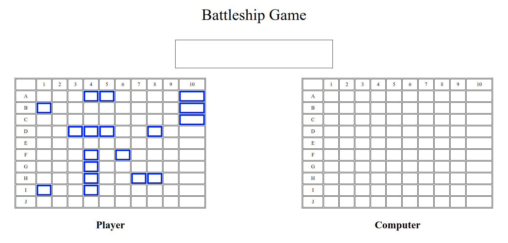

# Battleship Project

> This project is a simple version of the Battleship game using vanilla Javascript.
> The purpose of the project is to practice testing using Jest.

This project has this characteristics:
  - Has a basic interface that allows the user to select a cell to sink a ship.
  - Has a basic AI that plays with the user.
  - Declares a winner and restarts the game after.

## Built With

- HTML, CSS
- Javascript
- Webpack
- Jest

## Settings

- Select a username.
- Click on the computer's board to select a cell.
- If you hit a ship, it will be marked as red.
- If you miss, it will be marked as yellow.

## Live Demo

[Live Demo Link](https://majovanilla.github.io/battleship-game/)

## Authors

👤 **María Reyes**

- Github: [@majo_vanilla](https://github.com/majo_vanilla)
- Linkedin: [María José Reyes Parroquin](https://www.linkedin.com/in/majoreyesparroquin/)

👤 **Suman Shrestha**

- Github: [@sumancrest0001](https://github.com/sumancrest0001)

## 🤝 Contributing

Contributions, issues and feature requests are welcome!

Feel free to check the [issues page](https://majovanilla.github.io/battleship-game/issues).

## Show your support

Give a ⭐️ if you like this project!

## Acknowledgments

- Final Project of the Rails Section from the [Microverse Curriculum](https://www.microverse.org/)
- We followed the instructions of [The Odin Project](https://www.theodinproject.com/courses/javascript/lessons/battleship)

## 📝 License

Feel free to fork this project and improve it.
